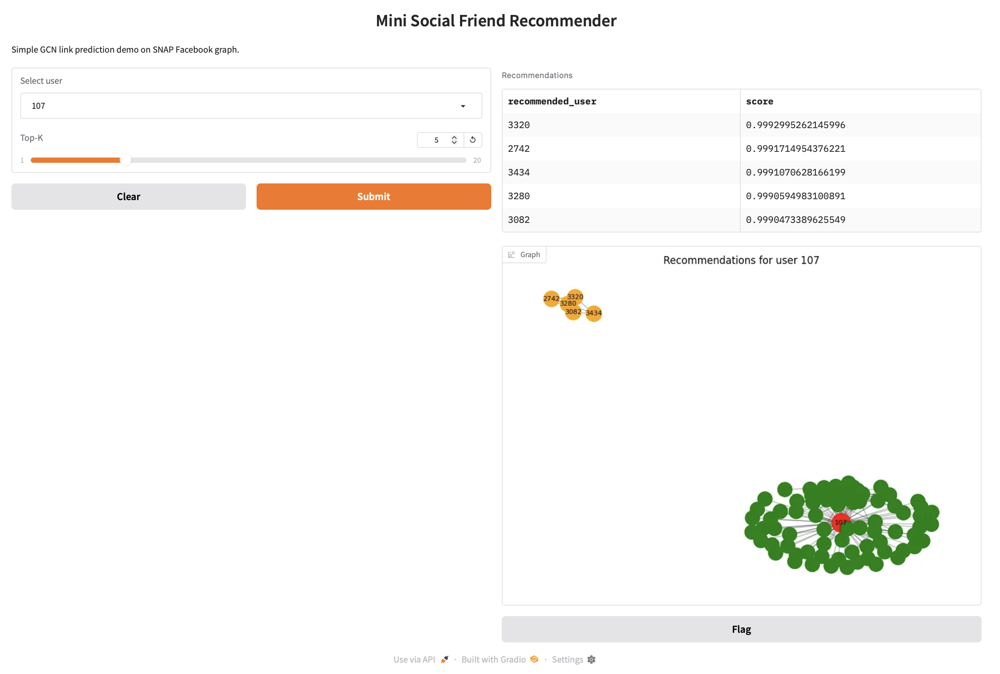
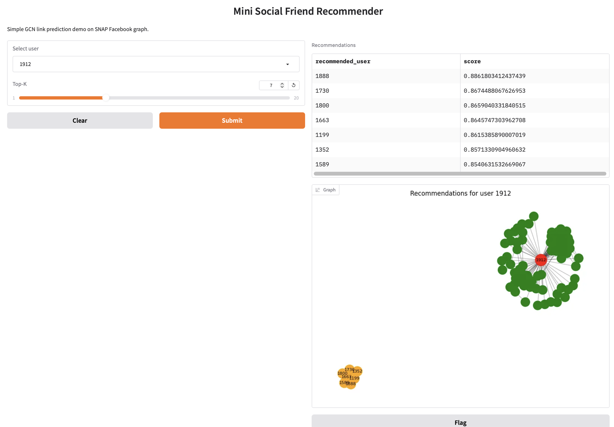
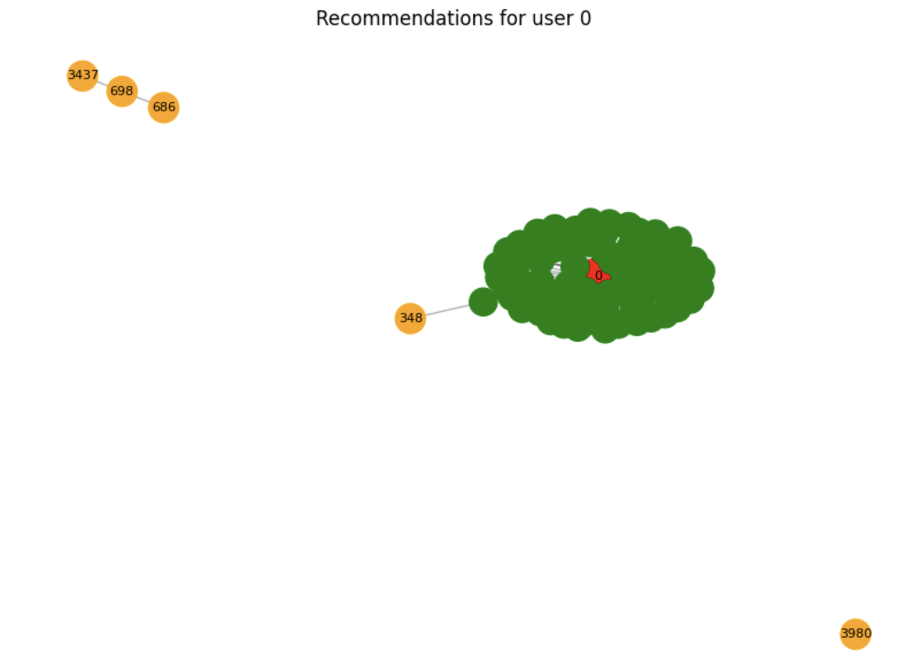

# SocialGraph-GCN

End-to-end link prediction on a real social graph using a Graph Convolutional Network (GCN), with explicit baseline comparison and interactive recommendations via Gradio.

Core implementation: `notebook/social_graph_link_prediction.ipynb`.

## Project Scope

- Build a complete link prediction pipeline from raw edge list to deployable demo.
- Train and evaluate a 2-layer GCN for missing-edge prediction.
- Compare against a structural heuristic baseline (Common Neighbors).
- Expose top-k friend recommendations with graph visualization.

## Dataset

- Source: SNAP Facebook Combined Graph
- URL: `https://snap.stanford.edu/data/facebook_combined.txt.gz`
- Format: undirected edge list (`u v`)

The dataset is downloaded and decompressed directly in Colab.

## Repository Structure

- `notebook/social_graph_link_prediction.ipynb`: main development notebook
- `results/social_graph_gcn_results.ipynb`: executed notebook with outputs
- `media/gradio_result.png`: Gradio interface output
- `media/gradio_result_2.png`: additional Gradio output
- `media/user_zero_result.png`: recommendation visualization for user 0

## Pipeline Overview

1. Install dependencies and set deterministic seeds.
2. Download/load Facebook edge list.
3. Build graph, remap IDs to contiguous indices, and compute node features:
- normalized degree
- clustering coefficient
4. Convert to PyTorch Geometric format and create train/validation/test splits with `RandomLinkSplit`.
5. Train a 2-layer GCN encoder with dot-product edge decoder.
6. Evaluate with ROC-AUC and Average Precision (AP).
7. Evaluate Common Neighbors on the same split.
8. Serve recommendations and local ego-network visualization in Gradio.

## Results

From `results/social_graph_gcn_results.ipynb`:

- Best Validation AUC: **0.9369**
- Test AUC (GCN): **0.9435**
- Test AP (GCN): **0.9455**

Comparison on test split:

| Method | ROC-AUC | Average Precision |
|---|---:|---:|
| GCN | 0.9435 | 0.9455 |
| Common Neighbors | 0.9932 | 0.9915 |

## Model Analysis

The result where Common Neighbors outperforms GCN on this split is consistent with the structural properties of the Facebook graph.

- The graph exhibits strong local clustering and triadic closure.
- Common Neighbors directly optimizes for this mechanism and is highly competitive in dense social subgraphs.
- GCN still achieves high predictive quality (AUC ~0.94), but the additional representational capacity is not fully exploited with only structural features.

This comparison is informative rather than negative: it shows that deep models should be justified by the data regime, not assumed superior by default.

## When GCN Becomes Preferable

The GCN approach is expected to gain relative advantage when:

- richer node features are available (text, profile metadata, multimodal signals),
- generalization is required across domains/communities,
- or inductive settings include new nodes unseen during training.

## Visual Results

## Run in Colab

1. Open `notebook/social_graph_link_prediction.ipynb` in Google Colab.
2. Optionally enable GPU via `Runtime -> Change runtime type -> GPU`.
3. Run all cells in order.
4. Use the Gradio section to inspect recommendations.

## License

MIT (`LICENSE`).
